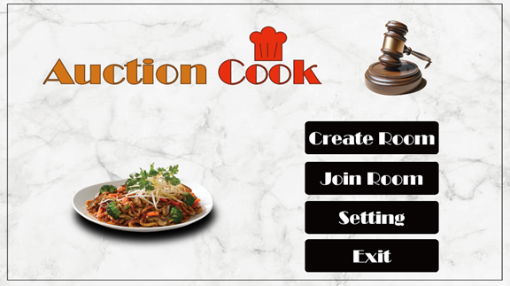

<div align="center">

# :cook: Auction Cook!
  
### Repository for Server(Back-end)
:open_file_folder: **Go to Repository for Client** : [Client](https://github.com/owl2lwo12/MSE_2024_FA)  
:key: **API Specification** : [Postman](https://auctioncook.postman.co/workspace/855a4b83-b897-46fd-aca3-9efe42f9125a)

</div>
<br><br>

## 🔍 Overview
The game is an auction simulation. You can play with up to 4 players, there are 12 recipes, and you have to bid for ingredients and complete the target recipe(by the recipe there will be differential points based on recipes), and the winner is the one with the highest score at the end.  

> A city of gourmets, famous for its delicious food. You are the chefs of four famous restaurants. Each of you is conscious of the others, and each of you thinks that you have better flavor than the other three. Then the mayor of a city of gourmet decides to organize a cooking competition to find the best restaurant in the city. The players will have to compete against each other to make it to the final round and prove who can cook the best and bring out the flavors of the ingredients.  

This is repository for 'Auction Cook!' of back-end part. This repository is built with Java, Spring Boot, and Redis. We've tried to follow and keep RESTful API concept while communicating between client and server.

<br><br>

## :hammer_and_wrench: Tech Stack


   

### Specific Description of Each Tech Stack
<table>
    <tr>
        <th><center>-</center></th>
        <th align="center"><center>이름</center></th>
        <th>사용 용도</th>
    </tr>
    <tr>
        <td><center></center></td>
        <td valign="">Java</td>
        <td valign="">Main programming language of Spring Boot</td>
    </tr>
    <tr>
        <td><center></center></td>
        <td valign="">Spring Boot</td>
        <td valign="">Main framework implementing main logics of server</td>
    </tr>
    <tr>
        <td><center></center></td>
        <td valign="">Redis</td>
        <td valign="">Managing user&room data with NoSQL schema</td>
    </tr>
    <tr>
        <td><center></center></td>
        <td valign="">AWS EC2</td>
        <td valign="">Serving server instance</td>
    </tr>
    <tr>
        <td><center></center></td>
        <td valign="">AWS ElasticCache</td>
        <td valign="">Serving Redis DB instance</td>
    </tr>
    <tr>
        <td><center></center></td>
        <td valign="">Postman</td>
        <td valign="">Testing APIs and sharing its documentation</td>
    </tr>
</table>

<br><br>

## :scroll: Guide
### Spring Boot

You have to add some settings on `application.properties` or `application.yml`.  

```
// .properties setting
spring.application.name: AuctionCookBE
server.port: 8080

// .yml setting
spring:
  application:
    name: AuctionCookBE

server:
  port: 8080
```

#### Local (Windows)
You can build and run server with **gradle** after cloning [git repo/main](https://github.com/SyingSHY/AuctionCook-BE).  
After clone on your local machine, you can run server with builded `.jar` file.

#### AWS
You can build and run server with **gradle** after cloning [git repo/main](https://github.com/SyingSHY/AuctionCook-BE).  
After clone on AWS EC2, you can run server with builded `.jar` file.
```
nohup java -jar <filename> &
```

<br> 

---
### Redis
To run server, you need to run Redis DB to let server manages user and room data.  
Depending on the server operating environment, the method for operating Redis DB may vary.  
You have to add some settings on `application.properties` or `application.yml`.  

```
// .properties
spring.data.redis.host: localhost
spring.data.redis.port: 6379

// .yml setting
spring:
  data:
    redis:
      host: localhost
      port: 6379
```

#### Local (Windows)
You can use **WSL** to run Redis on your local computer.  
Please refer to the following link for installation: [Microsoft Reference](https://learn.microsoft.com/ko-kr/windows/wsl/tutorials/wsl-database#install-redis)

#### AWS
You can use **ElasticCache for Redis** to run Redis on AWS.  
This service is included in FreeTier of AWS, but be careful for being charged.  
Please refer to the following link for installation and AWS settings: [Velog](https://velog.io/@ncookie/AWS-ElastiCache-Redis-%EC%A0%81%EC%9A%A9)

<br><br>

## :busts_in_silhouette: Team Member List
### Back-end Repository
|  Name  |      Major      |    Part    | E-Mail | Etc. |
| :----: | :------------: | :--------: | :--: | --- |
| [Seongho Yang(양성호)](https://github.com/SyingSHY) | Software | Server | tavara1725@ajou.ac.kr |  |

### Other Team Members
|  Name  |      Major      |    Part    | E-Mail | Etc. |
| :----: | :------------: | :--------: | :--: | --- |
| [Giho Shim(심기호)](https://github.com/owl2lwo12) | Digital Media | Client |  |  |
| [Gihyun Lee(이기현)](https://github.com/dev-ghlee) | Digital Media | Client |  |  |
| [Hwanjae Lim(임환재)](https://github.com/hawan105) | Digital Media | Game Design |  |  |